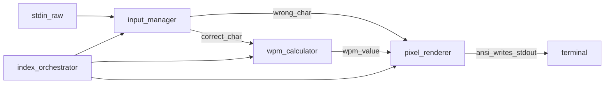

# wpm-racer — detailed implementation plan

## Repository deliverable (markdown)

This document lives in-repo at `plan/wpm-racer.md` alongside the implementation.

---

## Current state

The project is a Node.js + TypeScript CLI under `src/` with feature-based layout.

---

## Goals (from blueprint, tightened)

- **CLI typing benchmark** with **live** speed feedback (not end-of-run average only).
- **Sliding-window instantaneous WPM** from the last **N** correct keystrokes (target **N = 12**, tunable 10–15).
- **Accuracy-aware speed**: wrong keys **do not** enter the WPM window; they still affect accuracy and UX.
- **Low-flicker UI**: redraw **only** meter (and small HUD regions) via `ansi-escapes` + explicit cursor moves; avoid full `console.clear()` during typing.
- **Stack**: Node.js, TypeScript (strict), `chalk`, `ansi-escapes`, `process.stdin` **raw mode** + keypress events.

---

## Dependencies and scripts

| Package                            | Role                                                                              |
| ---------------------------------- | --------------------------------------------------------------------------------- |
| `typescript`, `tsx` (or `ts-node`) | Dev compile/run                                                                   |
| `chalk`                            | Meter and status colors                                                           |
| `ansi-escapes`                     | `cursorTo`, `eraseLine`, `cursorSavePosition` / `cursorRestorePosition` as needed |

**Scripts:** `pnpm dev` → `tsx src/index.ts`, `pnpm build` → `tsc` + copy `prompts.json`, `pnpm start` → `node dist/index.js`.

**TypeScript:** `strict: true`, `module`/`moduleResolution` `NodeNext`, `outDir: dist`, `rootDir: src`.

---

## Directory structure (feature-based)

```text
src/
  features/
    engine/
      input-manager.ts    # raw stdin, key normalization, lifecycle (enable/disable)
      wpm-calculator.ts   # timestamp ring/slice for correct keys only + WPM math
    ui/
      pixel-renderer.ts   # layout constants, meter + error flash, cursor-safe redraw
  data/
    prompts.json          # prose + optional code entries
  index.ts                # orchestration: state machine, render tick, exit/summary
plan/
  wpm-racer.md            # this plan
```

---

## Core data flow



---

## Engine design

### Input manager (`input-manager.ts`)

- Call `readline.emitKeypressEvents(process.stdin)` and `process.stdin.setRawMode(true)` when session starts; **always** restore tty on exit (`setRawMode(false)`, remove listeners, optionally `pause()` stdin).
- Handle **Ctrl+C** and **Ctrl+D** gracefully (summary or clean exit).
- Emit a **normalized key** model, e.g. `{ kind: 'char', value: string } | { kind: 'control', name: 'return' | 'backspace' | ... }`.
- **Backspace**: move logical cursor back; **undo last correct** timestamp in the WPM calculator when removing a previously counted correct character.

### WPM calculator (`wpm-calculator.ts`)

- Maintain `correctTimestamps: number[]` using `performance.now()`.
- On each **correct** character: `push(now)`; while length > `WINDOW_SIZE`, `shift()`.
- **Formula:** let `k` = number of timestamps in window, `dtMs` = `last - first`. Then:

  `wpm = (k / 5) / (dtMs / 60000)`

  Edge cases:

  - `k < 2` or `dtMs === 0`: return **null** (“not enough signal”).
  - Display cap **120** for meter bar mapping.

- **Public API:** `recordCorrect()`, `undoLastCorrect()`, `reset()`, `getInstantWpm()`, `getMeterWpm()`.

---

## UI / render design (`pixel-renderer.ts`)

### Layout (fixed rows)

- Row 0: title / mode / progress.
- Row 1: **pixel meter** (block chars, fixed width `METER_WIDTH`, e.g. 30).
- Row 2: **target line** (prompt excerpt).
- Row 3: **typing line** with colored progress.

### Meter

- Map `wpm` (0–120) → fill count `floor(wpm / 120 * METER_WIDTH)`.
- Characters: `█` filled, `░` empty.
- **Colors:** `wpm < 40` blue, `40–80` green, `> 80` red.
- **Anti-flicker:** `renderFullFrame` updates fixed rows without `console.clear()` during the run.

### Error feedback

- On mismatch: red background on next expected character; **do not advance** until the correct key is pressed.

---

## Prompts data (`src/data/prompts.json`)

Schema:

```json
{
  "categories": {
    "prose": [{ "id": "...", "text": "..." }],
    "code": [{ "id": "...", "text": "...", "language": "ts" }]
  }
}
```

---

## Main loop (`index.ts`)

**States:**

1. Pick prompt from `--mode prose|code`.
2. **Running** — index into expected string; sliding WPM; `renderFullFrame` each update.
3. **Summary** — net WPM, accuracy, duration; Enter to exit.

**Metrics:**

- **Accuracy** = `correctStrokes / (correctStrokes + incorrectStrokes)` (key attempts).
- **Net WPM** = `(cursorIndex / 5) / (elapsedMinutes)` at end (chars completed over wall time).

**CLI flags:**

- `--mode prose|code` (default `prose`).
- `--window 12` (optional, 2–30).

---

## Implementation phases

### Phase 1 — Engine foundation

- Raw stdin, `wpm-calculator`, minimal typing loop.

### Phase 2 — Render cycle

- `renderFullFrame`, meter, single-line / truncated prompt.

### Phase 3 — Polish and modes

- Summary screen, `--mode code`, prompts from JSON.

---

## Testing strategy

- **Pure tests:** `node:test` on `wpm-calculator` math and window trimming.

---

## Risks and decisions

| Topic                       | Recommendation                                                  |
| --------------------------- | --------------------------------------------------------------- |
| Paste / bulk input          | One keypress per event; no special paste handling in MVP.       |
| Terminal resize             | MVP: ignore.                                                    |
| Wide unicode                | MVP: monospace ASCII-oriented prompts.                          |
| `ansi-escapes` save/restore | Full-frame row redraw used instead for predictable cursor sync. |

---

## Order of file creation

1. `package.json`, `tsconfig.json`, `.gitignore`
2. `src/features/engine/wpm-calculator.ts` + tests
3. `src/features/engine/input-manager.ts`
4. `src/features/ui/pixel-renderer.ts`
5. `src/data/prompts.json`
6. `src/index.ts` wiring + summary
7. `plan/wpm-racer.md`
